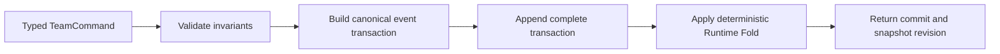

# Agent Orchestration

## Decision

Agent orchestration lives in one deep `Agent Team Runtime` module inside `greentyper-core`. Callers submit intent through `TeamRuntime::dispatch`; they do not activate Agents, resolve dependencies, reserve child budgets, order events, or wake Dormant Agents themselves.

The first runnable slice is intentionally synchronous and process-local. It proves canonical policy and deterministic recovery without choosing an async runtime, storage engine, Provider transport, Tool executor, or Git adapter.

## Interface

```rust
let mut team = TeamRuntime::new(max_active_agents)?;
let commit = team.dispatch(command)?; // Agent commands carry an AgentSession
let view = team.snapshot();
let events = team.event_log();
let recovered = TeamRuntime::recover(max_active_agents, events.iter().cloned())?;
```

- `dispatch` validates one typed `TeamCommand`, constructs one atomic event transaction, appends it, and only then replaces the Runtime Fold.
- `AgentSession` is process-local execution authority issued by this Runtime. Canonical Agent IDs remain inspectable but cannot authorize commands, old sessions fail after recovery, and the public Team interface intentionally exposes no ID-to-session rebind. The later Runtime Kernel recovery seam must rebind non-terminal owners without accepting model- or user-selected IDs.
- `snapshot` returns an immutable, deterministic projection ordered by canonical identifiers.
- `event_log` exposes the current in-memory canonical events for tests and the future Ledger seam.
- `recover` accepts only contiguous, complete transactions and rebuilds the same projection or fails closed.

The current `TeamCommit` is marked `CommitDurability::Volatile`. Its in-memory append proves ordering but is not a crash-safe Durability Boundary and must not drive a user-visible acknowledgement. Phase 1 will replace this implementation detail with the selected persistent Ledger adapter.

## Command Flow



Every transaction carries a monotonic transaction ID, Event sequence, zero-based position, and total Event count. Recovery rejects gaps, reordered positions, mixed transaction IDs, changed transaction sizes, incomplete tails, invalid transitions, and non-quiescent scheduler state.

## State Model

| Task state | Agent state | Meaning |
| --- | --- | --- |
| `Pending` | `Dormant` | Waiting for Task dependencies |
| `Ready` | `Dormant` | Runnable, but no Active slot is available |
| `Running` | `Active` | Consuming one bounded execution slot |
| `Blocked` | `Blocked` | A dependency failed, was cancelled, or became blocked; this non-terminal state requires explicit retry support in a later slice or `Cancel` now |
| `Succeeded` | `Succeeded` | Completion Capsule accepted |
| `Failed` | `Failed` | Explicit terminal failure recorded |
| `Cancelled` | `Cancelled` | Explicit terminal cancellation recorded |

Root admission and Delegation automatically reconcile scheduling. When a terminal transition releases a slot, the lowest canonical Ready Task activates in the same transaction. No timer, polling loop, or background thread exists.

## Invariants

1. One `TeamRuntime` has at most one root Agent.
2. Every Task has exactly one current Owner, represented by exactly one Agent in this slice.
3. A new Task may depend only on existing Tasks; canonical IDs are contiguous, so the explicit Task graph is acyclic by construction.
4. A delegated Task cannot depend on its parent or any ancestor Task. That would create an implicit cycle because ancestors cannot finish while descendants remain non-terminal.
5. Child scope and Capability Snapshot are exact set subsets of the parent's values.
6. Child budgets are reserved monotonically from the parent's unreserved token and tool-call budget. This conservative slice does not refund unused reservations.
7. Only a valid `AgentSession` for an Active Agent may Delegate, send messages, complete, or fail. Dormant and Blocked Agents consume no Active slot; Blocked Agents may be explicitly cancelled.
8. A parent cannot complete, fail, or cancel while a child remains non-terminal.
9. Failed, cancelled, or blocked dependencies synchronously block waiting dependents.
10. Task titles, scope labels, dependency lists, Capability Snapshots, tool names, messages, terminal reasons, and Completion Capsules are bounded before entering the Event Ledger. Completion Capsule list counts are bounded separately so empty strings cannot evade byte accounting; larger future payloads belong in Artifacts.

## Commands and Events

`AdmitRoot`, `Delegate`, `SendMessage`, `Complete`, `Fail`, and `Cancel` are the only commands in the first slice. Agent commands carry an opaque `AgentSession`, while Events retain the stable Agent ID. They emit canonical ownership, lifecycle, coordination, and Completion Capsule Events. Direct state mutation is private to the fold implementation.

Provider output, tool effects, approvals, Workspace Leases, Read Sets, merge outcomes, Config Epochs, Provider Epochs, and Context Checkpoints are deliberately absent. Adding them as generic fields now would create shallow or false seams.

## Dependency Strategy

- Canonical Task, Agent, budget, capability, Event, and fold logic is in-process and uses only the Rust standard library.
- The in-memory Event Ledger is a volatile test implementation, not a persistence contract.
- A persistent Ledger Store becomes a real internal seam when both volatile tests and the selected production store exist.
- Provider Runtime, Tool Runtime, and Workspace Coordinator retain separate interfaces because their retry, authority, and effect-ordering rules differ.
- The product and acceptance binaries continue to depend inward on `greentyper-core`; the core never depends on them.

## Next Slices

1. Define canonical serialization and plug `TeamRuntime` transactions into the Phase 1 Ledger Store with synchronous durability receipts.
2. Let Runtime Kernel admission create the root Agent and feed canonical Provider simulator Events without exposing wire types.
3. Add Workspace Coordinator facts, then exclusive Workspace Lease and Read Set adapters when the first writable Task lands.
4. Add Tool and Provider effect preparation/outcome records only after their own idempotency and recovery contracts exist.
5. Exercise Performance Contract workload P3 with two Active Agents on the Target Machine and four on FMDev; measure Dormant increment rather than assuming it.
