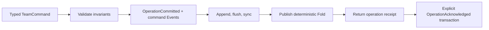

# Agent Orchestration

## Decision

Agent orchestration lives in one deep `Agent Team Runtime` module inside `greentyper-core`. Callers submit intent through `TeamRuntime::dispatch`; they do not activate Agents, resolve dependencies, reserve child budgets, order events, or wake Dormant Agents themselves.

The policy interface remains synchronous and process-local. It proves canonical policy and deterministic recovery without choosing an async runtime, Provider transport, Tool executor, or Git adapter. A separate provisional `DurableTeamRuntime` now plugs the same transactions into the Phase 1 file Ledger.

## Interface

```rust
let mut team = TeamRuntime::new(max_active_agents)?;
let commit = team.dispatch(command)?; // Agent commands carry an AgentSession
let view = team.snapshot();
let events = team.event_log();
let recovered = TeamRuntime::recover(max_active_agents, events.iter().cloned())?;

let mut durable = DurableTeamRuntime::open(team_ledger_path, max_active_agents)?;
let commit = durable.dispatch(command)?; // CommitDurability::Synchronous

let (mut kernel, recovered) = RuntimeKernel::open_with_team(
    runtime_ledger_path,
    team_ledger_path,
    max_active_agents,
)?;
let root_operation = kernel.dispatch_team(TeamCommand::AdmitRoot {
    task,
    budget,
    capabilities,
})?;
kernel.acknowledge_team_operation(root_operation.operation)?;
let rebound = recovered.into_sessions(); // complete per-open set; no ID lookup
let operation = kernel.dispatch_team(command)?;
kernel.acknowledge_team_operation(operation.operation)?;
```

- `TeamRuntime::dispatch` validates one typed `TeamCommand`, constructs one atomic in-memory event transaction, appends it, and only then replaces the Runtime Fold.
- `DurableTeamRuntime::dispatch` prepares the same validated transaction, checks the locked Ledger Head, synchronously appends it, receives a checksum-bound receipt, and only then publishes the Runtime Fold. Planning, encoding, Head, or append failure leaves the projection and identifiers unchanged; ambiguous durability poisons the writer and requires reopen rather than blind retry.
- `AgentSession` is process-local execution authority issued by this Runtime. Canonical Agent IDs remain inspectable but cannot authorize commands, old sessions fail after recovery, and the public Team interface intentionally exposes no ID-to-session rebind. `RuntimeKernel::open_with_team` owns the adapter writer and returns one `KernelTeamRecovery` containing the complete non-terminal Session set derived from validated replay; it never accepts an Agent ID to mint authority.
- `RuntimeKernel::dispatch_team` is the Kernel's single Team write interface, including typed root admission. It allocates a monotonic non-authorizing `TeamOperationId`, commits that identity in the same checksummed transaction as the command Events, and does not publish a Team Fold before its synchronous receipt. A committed operation blocks later Team commands until `acknowledge_team_operation` durably records acknowledgement in the same Team Ledger; duplicate acknowledgement is a no-op.
- `snapshot` returns an immutable, deterministic projection ordered by canonical identifiers.
- `event_log` exposes the current canonical events for tests and projection inspection.
- `recover` accepts only contiguous, complete transactions and rebuilds the same projection or fails closed.

Plain `TeamRuntime` commits remain `CommitDurability::Volatile` and cannot drive a user-visible acknowledgement. `DurableTeamRuntime` returns `CommitDurability::Synchronous` only after the dedicated Team Ledger has flushed a complete checksummed transaction. The core Runtime Kernel now owns that adapter when opened with a dedicated Team Ledger, gates root admission, persists operation identity and acknowledgement records, exposes pending operation status through `KernelTeamSnapshot`, and issues one consumable recovery bundle per open for Active, Dormant, and Blocked owners while excluding terminal Agents. Sessions inside the bundle remain ordinary copyable process-local capabilities. Standalone adapter recovery still invalidates every old Session. Operation IDs remain inspection and reconciliation identities, never Agent authority; no caller-selected ID conversion exists. Product CLI, Provider/Tool driving, and user-visible Team acknowledgement remain outside this slice.

## Command Flow



Every Team transaction carries a monotonic transaction ID, Event sequence, zero-based position, and total Event count. Team recovery rejects gaps, reordered positions, mixed transaction IDs, changed transaction sizes, incomplete tails, invalid transitions, and non-quiescent scheduler state. The separate Phase 1 file Ledger reports and repairs one checksummed torn final frame only on explicit writer recovery; read-only inspection never mutates it.

## State Model

| Task state | Agent state | Meaning |
| --- | --- | --- |
| `Pending` | `Dormant` | Waiting for Task dependencies |
| `Ready` | `Dormant` | Runnable, but no Active slot is available |
| `Running` | `Active` | Consuming one bounded execution slot |
| `Blocked` | `Blocked` | A dependency failed, was cancelled, or became blocked; this non-terminal state requires explicit retry support in a later slice or `Cancel` now |
| `Succeeded` | `Succeeded` | Completion Capsule accepted |
| `Failed` | `Failed` | Explicit terminal failure recorded |
| `Cancelled` | `Cancelled` | Explicit terminal cancellation recorded |

Root admission and Delegation automatically reconcile scheduling. When a terminal transition releases a slot, the lowest canonical Ready Task activates in the same transaction. No timer, polling loop, or background thread exists.

## Invariants

1. One `TeamRuntime` has at most one root Agent.
2. Every Task has exactly one current Owner, represented by exactly one Agent in this slice.
3. A new Task may depend only on existing Tasks; canonical IDs are contiguous, so the explicit Task graph is acyclic by construction.
4. A delegated Task cannot depend on its parent or any ancestor Task. That would create an implicit cycle because ancestors cannot finish while descendants remain non-terminal.
5. Child scope and Capability Snapshot are exact set subsets of the parent's values.
6. Child budgets are reserved monotonically from the parent's unreserved token and tool-call budget. This conservative slice does not refund unused reservations.
7. Only a valid `AgentSession` for an Active Agent may Delegate, send messages, complete, or fail. Dormant and Blocked Agents consume no Active slot; Blocked Agents may be explicitly cancelled.
8. A parent cannot complete, fail, or cancel while a child remains non-terminal.
9. Failed, cancelled, or blocked dependencies synchronously block waiting dependents.
10. Task titles, scope labels, dependency lists, Capability Snapshots, tool names, messages, terminal reasons, and Completion Capsules are bounded before entering the Event Ledger. Completion Capsule list counts are bounded separately so empty strings cannot evade byte accounting; larger future payloads belong in Artifacts.

## Commands and Events

`AdmitRoot`, `Delegate`, `SendMessage`, `Complete`, `Fail`, and `Cancel` are the only commands in the first slice. Agent commands carry an opaque `AgentSession`, while Events retain the stable Agent ID. They emit canonical ownership, lifecycle, coordination, and Completion Capsule Events. Direct state mutation is private to the fold implementation.

Provider output, Tool effects, approvals, Workspace Leases, Read Sets, merge outcomes, Config Epochs, Provider Epochs, and Context Checkpoints remain deliberately absent from the Team Event model. Tool identity, approval, and effect recovery now live in a separate deep Tool Runtime because their authority and retry rules differ; they are not generic Team fields.

## Dependency Strategy

- Canonical Task, Agent, budget, capability, Event, and fold logic is in-process and uses only the Rust standard library.
- The in-memory Event Ledger remains the volatile policy-test implementation.
- `DurableTeamRuntime` is an external adapter over the provisional Phase 1 file Ledger. It uses a dedicated Team Ledger, a versioned bounded codec for all 19 Team Event kinds, historical schema-one replay for the original 17 domain Events, exclusive writer ownership, synchronous receipts, complete-prefix replay, and fail-closed schema/checksum/state validation.
- The adapter is not the final storage choice or migration contract. The Kernel ownership seam is implemented in core, while candidate selection and production migration remain separate decisions.
- Provider Runtime, Tool Runtime, and Workspace Coordinator retain separate interfaces because their retry, authority, and effect-ordering rules differ.
- The product and acceptance binaries continue to depend inward on `greentyper-core`; the core never depends on them.

## Next Slices

1. Connect the implemented Responses text/function-call decoder to a concrete Provider transport and map function calls through the Tool Runtime; extend the private fixed `local.echo` tracer into a public product Tool path only after caller-selected process policy and complete Windows Job evidence can fail closed.
2. Connect the Kernel-owned Team operation journal and Tool outcome to product driving and user-visible acknowledgement only after the concrete Provider/Tool effect path exists.
3. Add Workspace Coordinator facts, then exclusive Workspace Lease and Read Set adapters when the first writable Task lands.
4. Extend byte-offset process termination from the Team Ledger transaction seam to every product Provider/Tool delivery and acknowledgement boundary.
5. Exercise Performance Contract workload P3 with two Active Agents on the Target Machine and four on FMDev; measure Dormant increment rather than assuming it.
