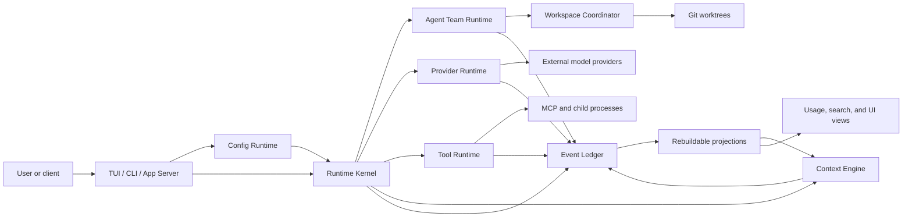

# Architecture

## System Intent

GreenTyper is a recoverable coding-agent runtime optimized for constrained Windows machines. Its architecture protects four properties in order: correctness of externally visible effects, recoverability from the Event Ledger, explicit authority, and the Performance Contract. Broad compatibility and convenience features may be reduced before any of these properties.

This document describes the target architecture. Implemented boundaries and
deferred modules are tracked in the [implementation plan](implementation-plan.md);
the presence of a box or ownership statement below does not by itself claim a
shipped product surface.

## Architectural Invariants

1. The Event Ledger is authoritative. A projection, cache, checkpoint, summary, UI view, or provider continuation identifier is never truth.
2. Externally visible tool effects cross a Durability Boundary before execution or acknowledgement.
3. A successful or ambiguous tool effect is never repeated automatically after retry or recovery.
4. A Turn sees immutable Config, Provider, Toolset, and Capability snapshots.
5. Delegation can reduce authority, scope, and budget, but cannot expand them.
6. Context reduction cannot delete history, grant authority, or promote unverified Durable Memory.
7. Provider wire objects stop at the Provider Runtime. The Runtime Kernel consumes canonical Items and Events.
8. Idle work is event-driven. No module may add periodic polling or redraw without a measured Performance Contract exception.

## Deep Modules

GreenTyper starts as one Cargo workspace with a small number of deep modules. A module owns a coherent body of policy behind a narrow interface; internal helpers and test seams are not exported merely to create more crates.

### Runtime Kernel

Owns Turn admission, logical Agent state machines, resource budgets, cancellation, failure propagation, and orchestration across the other modules. Its interface accepts intent and emits durable outcomes; callers do not coordinate provider retries, tools, checkpoints, or child Agents themselves.

### Ledger Store

Owns append ordering, transaction identity, Durability Boundaries, event-range compare-and-swap, recovery scans, schema migration, and rebuild hooks. Storage engines remain internal adapters while SQLite WAL and a custom append log are benchmarked; only the selected implementation becomes a supported persistence contract.

Critical approval, ownership, and effect records are synchronously durable. Recoverable streaming text may be committed in bounded batches, initially targeting about 250 ms.

### Provider Runtime

Owns Provider Templates, Profiles, Origins, the Model Catalog, Model Presets, dialect translation, transport selection, continuation state, retry classification, raw-event artifacts, and normalized Usage Records.

Its external seam is canonical request and event semantics. OpenAI Responses, OpenAI Chat Completions, and Anthropic Messages are adapters at that seam. SSE, WebSocket, and ordinary HTTP are transports rather than dialects. Context Mode remains independent of both.

A Model Preset is resolved once per Turn. A provider or model change starts a new Provider Epoch, rebuilds context from canonical state, and does not reuse an incompatible continuation identity.

### Tool Runtime

Owns Capability Snapshots, approvals, Tool Ledger idempotency, process launch, filesystem/network/process sandbox policy, MCP exposure, and effect reconciliation. High-frequency tools may be direct; long-tail tools stay behind a stable search/describe/call gateway.

Windows process isolation uses audited wrappers around `CreateProcessW`, Job Objects, and related native interfaces. PowerShell is an explicit shell or Skill dependency, not a hidden process-launch layer.

### Agent Team Runtime

Owns the Task dependency graph, one-owner rule, Agent lifecycle, Delegation, communications, Completion Capsules, global and sub-budgets, and explicit merge outcomes. Logical Agents share the runtime process but keep independent Threads, Context Views, Provider choices, and Capability Snapshots.

### Workspace Coordinator

Owns Read Sets, Workspace Leases, worktree assignment, stale-read validation, and explicit integration/conflict results. Many Agents may read one worktree; one Agent may write it. Parallel writers use separate worktrees.

### Context Engine

Owns Context Pressure calculation, artifact offload, deterministic reduction, Runtime Folds, semantic handoff, Context Checkpoints, provider-native compaction adapters, and Durable Memory retrieval.

Checkpoint creation uses a Safe Barrier and event-range compare-and-swap. The Compactor has no tools, MCP access, credentials, or Durable Memory write capability. Periodic full rebases from the Event Ledger prevent recursive-summary drift.

### Config Runtime

Owns the Config Schema, layer resolution, validation, Config Drafts, atomic writes, backups, effective provenance, Config Epochs, and hierarchical Command Paths. TUI editors, CLI operations, and App Server operations call the same interface.

Credentials are referenced by Config Objects but stored separately in Windows Credential Manager or DPAPI-protected storage. Changing a Provider Origin requires an explicit credential binding and a resolved pricing decision. A reviewed bundled rate card may supply only a distinctly provenanced mirror estimate; it does not transfer credential or origin authority.

### Presentation

The TUI, CLI, and App Server translate user intent into Runtime Kernel and Config Runtime operations. They contain interaction state, rendering, and transport code, but no separate business rules. The root Slash Panel exposes a small set of Command Paths; nested configuration actions appear only within `/config`, while a global command palette may search the full action registry.

## Runtime and Process Model

- One main process and one I/O event loop.
- At most two lazily created workers for CPU-bound runtime work.
- Default Target Machine concurrency: two Active Agents; additional Agents checkpoint as Dormant Agents.
- FMDev validation concurrency: up to four Active Agents when the workload calls for it.
- Tool commands and MCP servers run as constrained child processes when required.
- MCP transports may be shared only for identical configuration and credential identity; each Agent retains an isolated capability view.
- Caches are bounded and evictable. Large outputs become Artifacts rather than resident prompt or heap data.

## State and Recovery

The Event Ledger records user input, canonical provider output, tool calls and effects, approvals, task ownership, Agent communication, checkpoints, configuration epochs, and Usage Records. Rebuildable projections include search indices, UI views, usage rollups, context views, and runtime folds.

Recovery replays the Ledger to the latest valid Safe Barrier, reconciles Tool Ledger outcomes, restores exact Skill identities, and resumes only when the required Config and Provider state can be reconstructed. Unsupported newer schemas fail closed. Migrations create recoverable backups and never silently downgrade stored state.

## Provider and Model Resolution

Release-bundled Provider Templates cover OpenAI, DeepSeek, and OpenCode Go with official default routes. Every Provider Profile may override its base URL and declared routes for a gateway. Custom origins require an explicit credential binding and are reported separately in statistics. When a template has a reviewed bundled rate card, its custom origins default to a frozen `template_mirror` estimate; an explicit pricing choice overrides it, and templates without a bundled rate card still require one. A mirror never asserts credential, origin, or hidden-backend authority.

The Model Catalog merges release seeds, lazy provider discovery, and explicit user overrides with field-level provenance and freshness. Remote catalog data may identify models and bounded metadata, but cannot inject credentials, arbitrary endpoints, instructions, or authority. Discovered models without a verified dialect remain visible but unavailable until configured.

## Usage and Context Observability

Every inference attempt records provider/profile identity, requested and observed model, dialect, start and completion time, reasoning effort, service tier, token classes, cache reads and writes when reported, and cost provenance. Unsupported values remain unknown.

Usage Rollups provide current Turn, Thread, Agent, Agent Team, rolling 1-hour/1-day/7-day, and named Usage Window views without scanning history during render. Context status combines projected next-request occupancy, output reserve, last provider-reported usage, and an exact/estimated marker.

## Trust and Security

- Skills guide workflow but never grant capabilities.
- MCP resources, prompts, and results are untrusted data.
- Ordinary tool processes have no network authority by default.
- Provider and explicitly authorized MCP connections may use declared network routes.
- Approval Grants bind Agent, operation, arguments, resources, network targets, and expiry.
- Remote telemetry is disabled; Diagnostic Bundles are local, redacted, and shared only by explicit user action.
- Full Ledger encryption is not the default; restrictive ACLs, secret separation, and redaction protect the low-overhead local store.

## Deliberate v1 Exclusions

Local inference, remote Agent workers, ChatGPT OAuth/private backends, arbitrary in-process plugins, MCP Apps UI, automatic extension download, automatic model routing, legacy consoles, and background auto-update are outside v1.
