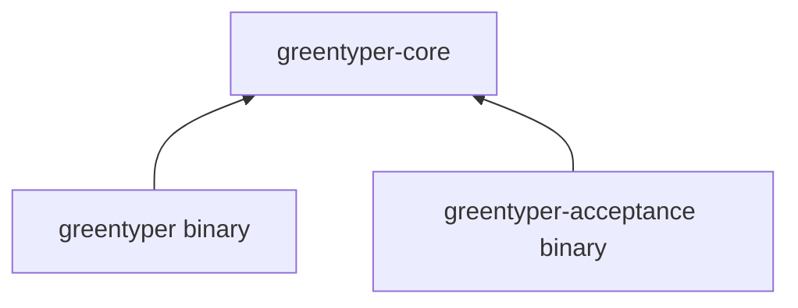

# Code Layout

## Rule

GreenTyper uses one Cargo workspace with three packages. Packages represent compilation and delivery seams, not individual architecture modules. Runtime policy stays concentrated in one deep core library; product and acceptance binaries depend on it and never the reverse.

```text
greentyper/
|- crates/
|  |- greentyper-core/        canonical model and runtime policy
|  |- greentyper/             product composition and presentation
|  `- greentyper-acceptance/  isolated Target Machine runner
|- docs/                      contracts, architecture, and ADRs
|- .cargo/                    target-specific build policy
|- Cargo.toml                 workspace policy and dependency graph
`- rust-toolchain.toml        reproducible compiler baseline
```

## Package Responsibilities

### `greentyper-core`

The only library package. It contains the canonical model, Config Runtime,
provisional file Ledger, deterministic Provider seam, bounded generic SSE plus
OpenAI Responses, Chat Completions, and Anthropic Messages dialect decoding,
recoverable single-Agent Runtime Kernel,
Agent Team Runtime, durable Tool Runtime policy, and the immutable Usage
Attempt/window/rollup projection. It also owns the immutable release Provider
Catalog and its field provenance. Config Runtime owns catalog-template
resolution, schema-derived Command Paths, and the terminal-neutral
revision-bound editor session used by future presentation adapters. Later slices
add Workspace Coordinator and deepen the initial pure Context Pressure projector
into the full Context Engine; concrete Provider and Tool integration stays
behind the narrow core interfaces and is owned by the product package.

Provider simulators, in-memory stores, and other test adapters live beside the interfaces they exercise. Internal helpers are not promoted into packages merely to make them independently visible.

The core must build and run pure tests on macOS ARM. Platform-specific I/O enters through explicit seams; canonical policy never depends directly on a terminal, network stack, credential store, or Windows handle.

### `greentyper`

The shipped product executable. It owns composition and the target TUI, CLI,
App Server, and concrete production adapters. Its current private modules
include configured Responses and Chat Completions HTTP/SSE plus the DeepSeek
Chat Completions and Messages HTTP/SSE request policies, a bounded
Provider connection and model-list observation adapter, origin-bound Windows Credential
Manager access, the fixed
`local.echo` process executor, a terminal-neutral presentation projection, Config
Object lifecycle/Provider-wizard controller, deterministic viewport-row layout, and a
ProductDriver that composes the Kernel-owned Team, Tool, Provider, approval, and
delivery seams. Its first product terminal tracer privately owns a
Direct VT cell-diff renderer, blocking Crossterm event adapter, alternate-screen
and raw-mode lifecycle, the public `tui` command, metadata-driven user-scope
statusline-preset and statusline-expansion choice editors, and one existing-
Provider base-URL text editor over the existing Config Runtime. It also owns a
bounded Provider Profile ID prompt, release-template/opaque-reference creation
flow, status-only existing-reference editor, and an F5 control that invokes the
bounded Provider candidate connection tester. A second bounded object-name flow
creates minimal Model Presets from Provider, model, and dialect fields.
Section-filtered typed remove
routes render exact Config Object deletion confirmations; secret storage stays
behind the credential adapter. Remaining
mutable terminal editors, approval interaction, live refresh, the App Server, and an audited Windows
ConPTY wrapper remain pending. Platform wrappers for process,
credential, transport, and eventually terminal facilities remain private to
this package unless a second real caller proves a smaller shared package is
needed.

Presentation translates user intent into core interfaces. It does not reimplement runtime, configuration, usage, or authority policy.

### `greentyper-acceptance`

A separately packaged executable for the asynchronous Target Machine Acceptance Run. It owns machine fingerprinting, CPU-baseline checks, workload orchestration, measurement, redaction, and evidence-manifest production. It may reuse canonical types from `greentyper-core`, but the product executable never depends on it.

## Dependency Direction



No dependency points from `greentyper-core` into either binary. Shared code moves into core only when it expresses canonical policy or a proven reusable interface; delivery-specific helpers remain local.

## Growth Rules

1. Add a core module with its first runnable vertical slice, not as an empty directory.
2. Test behavior through the owning module's interface. Keep dense pure-algorithm tests close to their implementation.
3. Put redacted provider, Ledger, crash, configuration, terminal, and Memory fixtures under `tests/fixtures/`; the versioned acceptance fixture establishes this layout.
4. Put benchmark targets beside the package whose interface they measure. Cross-process Target workloads belong to the acceptance package.
5. Add `fuzz/`, `packaging/`, and automation directories only with their first executable target.
6. Create another package only when it establishes a real compile, safety, or delivery seam with at least two justified callers or adapters.

This layout deliberately leaves the internal module tree absent in the initial scaffold. Empty module files create navigation cost without behavior, interfaces, or tests.
