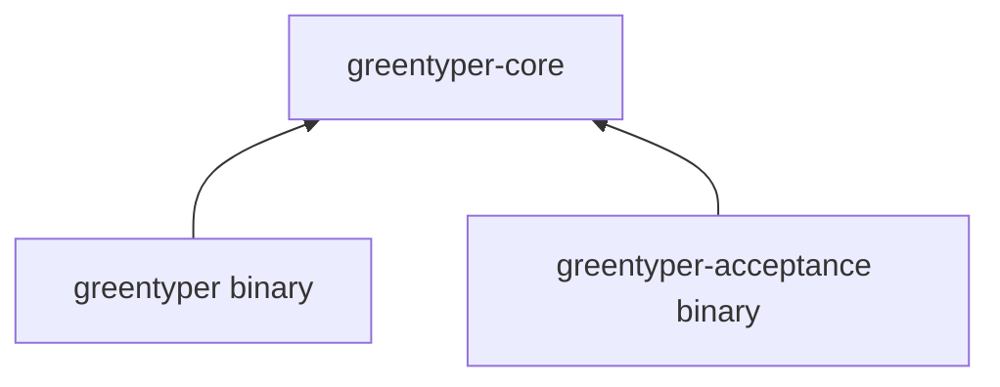

# Code Layout

## Rule

GreenTyper uses one Cargo workspace with three packages. Packages represent compilation and delivery seams, not individual architecture modules. Runtime policy stays concentrated in one deep core library; product and acceptance binaries depend on it and never the reverse.

```text
greentyper/
|- crates/
|  |- greentyper-core/        canonical model and runtime policy
|  |- greentyper/             product composition and presentation
|  `- greentyper-acceptance/  isolated Target Machine runner
|- docs/                      contracts, architecture, and ADRs
|- .cargo/                    target-specific build policy
|- Cargo.toml                 workspace policy and dependency graph
`- rust-toolchain.toml        reproducible compiler baseline
```

## Package Responsibilities

### `greentyper-core`

The only library package. It contains the canonical model, Config Runtime,
provisional file Ledger, deterministic Provider seam, bounded generic SSE plus
OpenAI Responses, Chat Completions, and Anthropic Messages dialect decoding,
recoverable single-Agent Runtime Kernel,
Agent Team Runtime, durable Tool Runtime policy, the immutable Usage
Attempt/window/rollup projection, and the initial Context Engine foundation.
The latter owns exact-head canonical Context Views, bounded SHA-256 artifact
references, Safe Barrier checkpoint CAS/replay, soft-pressure publication, and
the bounded checkpoint-to-Provider request projection used by admission and
resume; it has no Tool, credential, MCP, or Memory authority. Core also owns the immutable release Provider
Catalog and its field provenance. The independent Provider Discovery module owns
the bounded schema-1 observation file, no-follow inspection, writer locking,
validation, and atomic per-Profile replacement; it stores no Config, Ledger,
credential, origin, capability, or execution authority. Config Runtime owns catalog-template
resolution, schema-derived Command Paths, and the terminal-neutral
revision-bound editor session used by future presentation adapters. Later slices
add Workspace Coordinator and deepen the Context foundation with semantic
handoff, provider-native compaction, Artifact storage, and Durable Memory;
concrete Provider and Tool integration stays behind the narrow core interfaces
and is owned by the product package. The product adapters map projected Context
Items into Responses, Chat Completions, and Messages request bodies and keep the
same conversation across the supported one-Tool continuation. The default
canonical Context Mode is frozen in Config Epochs, uses full bounded completed
history or a verified checkpoint tail, and is reconstructed on resume;
provider-native execution remains fail-closed.

Provider simulators, in-memory stores, and other test adapters live beside the interfaces they exercise. Internal helpers are not promoted into packages merely to make them independently visible.

The core Workspace Coordinator slice owns bounded workspace/worktree identity
facts and, on Unix, root-inode-bound directory handles, shared/exclusive local
Lease locks, component-by-component no-follow Read Set capture, and bounded
revalidation. Windows Lease/Read Set operations fail closed until an audited
reparse-point-safe handle adapter lands; facts remain portable. It does not
execute Git, assign worktrees, mutate files, or add Workspace fields to Team
Events.

The core must build and run pure tests on macOS ARM. Platform-specific I/O enters through explicit seams; canonical policy never depends directly on a terminal, network stack, credential store, or Windows handle.

### `greentyper`

The shipped product executable. It owns composition and the target TUI, CLI,
App Server, and concrete production adapters. Its current private modules
include configured Responses and Chat Completions HTTP/SSE plus the DeepSeek
Chat Completions and Messages HTTP/SSE request policies, a bounded
Provider connection and model-list observation adapter, origin-bound Windows Credential
Manager access, the fixed
`local.echo` process executor, a bounded discovery-only MCP stdio adapter, a
terminal-neutral presentation projection, Config Object lifecycle/Provider-wizard
controller, deterministic viewport-row layout, and a ProductDriver that composes
the Kernel-owned Team, Tool, Provider, approval, and delivery seams. The public
`retry --turn ID` and `cancel --turn ID` paths use
strict existing-state open, recovered Active Agent authority for Product
Ledgers, and schema-14 Runtime recovery. A recovery request for an initial
Provider failure selects the next already-frozen Preset fallback first; when no
candidate remains it rearms the active candidate. Both retain the frozen Turn
and immutable candidate Epochs. Cancellation calls no Provider. Neither path
repairs or creates state or mutates Team/Tool Ledgers. Its first product terminal
tracer privately owns a Direct VT cell-diff renderer, blocking Crossterm event
adapter, alternate-screen and raw-mode lifecycle, the public `tui` command, and metadata-driven rendered
interactions for every user-scope Config Schema field over the existing Config
Runtime. Top-level and statusline fields open directly; existing object fields
use kind-filtered selection. The CLI composes the Provider connection tester,
core discovery store, release catalog, and Config Draft/CAS into explicit
`discovery status`, `refresh`, `catalog`, and `accept` flows. Failed probes do
not enter the writer path; merge is read-only; acceptance requires a current
Profile fingerprint and explicit supported dialect. The Direct VT model browser
uses the same shared release/discovery projection and derives Recent from
durable Usage. Entering `/model` runs one bounded foreground discovery probe
only for an eligible selected Profile; F5 explicitly retries it. Probe failure
preserves the prior observation/view, and ordinary input, resize, idle time, and
F6/Ctrl-R do not probe. Each action lazily creates one worker for that single
probe and joins it before the blocking event loop resumes; no discovery worker
or timer remains while idle. Discovery acceptance revalidates the
exact observation before it opens an ordinary Config Draft. It also owns a
schema-2 release-starter update flow shared by CLI, App Server, and Direct VT:
complete read-only provenance gates an explicit Draft, user policy is
preserved, and drift or CAS conflict leaves Config recoverable without any
Provider, credential, Agent, or Ledger action. It also owns a bounded
`context status`/`context preview`/`context handoff`/`context reduce` CLI surface.
Status, preview, and handoff delegate to read-only Runtime inspection; reduce strictly reopens existing Runtime state,
includes Team/Tool sidecars when present so the core can enforce its Safe
Barrier, and writes no Config, Team, Tool, credential, or Provider state. It also owns App
Server `context.handoff` inspection and explicit `context.reduce` publication
over the same Runtime API; the mutation returns only bounded checkpoint facts
and keeps Config/Team/Tool state unchanged. It also owns a
bounded Provider Profile ID prompt,
complete non-secret Profile field flow, status-only opaque-reference editor, an
F5 control that invokes the bounded Provider candidate connection tester, and
an F7 flow that delegates hidden bind/replace, status-only test, and confirmed
forget to the origin-bound platform credential adapter. A
second bounded object-name flow creates complete Model Presets across required
and optional fields.
The third bounded object-name flow creates named Usage Windows from start, end,
weekday-list, and time-zone fields while keeping partial structured input local
until it can be parsed atomically.
The fourth creates manual Price Schedules across all 17 schema fields while
keeping partial non-negative-integer input local until it can be parsed
atomically.
The same private terminal composition now owns `/model`, `/stats`, `/agent`, `/context`, and `/blockers`
browsers over local Config Catalog, Usage, and strict Team-sidecar projections.
All provide bounded query/group/row/detail navigation. Stats and ordinary Agent
browsing remain read-only. The Agent Center additionally owns a bounded `A`
action flow: delegation, messaging, completion, failure, cancellation, and
exact pending-operation acknowledgement delegate authority to ProductDriver;
restart and failure preserve the pending operation for retry. It also projects
the selected Agent's persisted Provider Turn owner and exposes explicit retry,
resume, prepared-output reopen, and delivery acknowledgement without falling
back to root authority. The Context screen
exposes exact-head inspection plus confirmed Safe-Barrier reduction. On compatible release detail, a second Enter creates an
ordinary revision-bound user-scope Preset Draft through the core Config Runtime;
CLI and App Server entry points reuse the same operation. On configured Model
detail, a second Enter may stage one bounded Runtime selection for the
authenticated current Agent's next Turn; it
does not mutate Config, contact a Provider, read credentials, or affect child
Agents. Team inspection uses a
shared lock, never creates or repairs state, exposes no Agent Session authority,
and fails closed on corruption or incomplete Product sidecars. F6 or Ctrl-R
replaces the local snapshot only after all independent reads succeed and
preserves the prior Config runtime and view on failure; it does not claim a
cross-Ledger transactional instant, and there is no background polling.
The `/blockers` list is snapshot-backed. Its first Tool-approval Enter shows a
local warning; the second confirms an explicit ProductDriver action that may
use credentials, append Usage/cost records, and affect Provider quota or
billing. It authenticates the rebound Active Agent Session, reconstructs the
frozen Provider, and keeps exact arguments/resources in one process-local
approval context until Escape, Approve, or Deny. The
terminal never converts an Agent ID into authority, and it delegates approval,
effect ordering, denial, and delivery acknowledgement back to the Kernel.
A retryable Runtime blocker instead rearms only the exact persisted Turn and
returns to `resume-required`; it performs no Provider, credential, Tool, or
delivery work.
The private App Server module owns a bounded newline-delimited JSON stdio loop
over the existing Config Runtime and fixed startup Runtime Ledger path. It keeps
at most 64 connection-local Drafts,
maps typed values and fixed public errors, rejects secret reads, and delegates
validation, revision CAS, backup, and atomic commit policy to core instead of
reimplementing it. Its write-only credential operations delegate origin-bound
bind/replace/test/forget policy to the credential adapter, scrub the owned input
frame, return status only, and never acquire Provider or Agent authority.
Its read-only Runtime status/Usage, Agent Team, and Tool status operations call
existing strict inspection adapters and then apply narrow wire projections.
They never create or repair Ledgers or return Runtime/Team/Tool text payloads.
It also owns the bounded project Skill adapter: `skill.list` reads only the
startup project root, while `skill.run` pins manifest content, requires explicit
approval, and delegates the fixed `local.echo` effect to Tool Runtime. Skills
cannot add capabilities, choose another filesystem root, or invoke arbitrary
scripts.
The `mcp` CLI adapter launches one explicitly selected absolute-path local
stdio server, negotiates the current protocol, and returns only a bounded
`tools/list` projection. It reuses product child containment and has no Tool
Runtime, Config, credential, approval, remote transport, or background
authority.
The same module exposes bounded `runtime.cancel`, `runtime.retry`,
`runtime.resume`, `runtime.delivery`, `runtime.acknowledge`, `tool.reconcile`,
fixed `local.echo` `tool.decide`, and Agent Team lifecycle operations. The
Agent surface delegates downward-only creation, messaging, Completion Capsules,
failure, cancellation, and operation acknowledgement to ProductDriver and the
Kernel. It returns only stable IDs/counts, never Team text, scope/capability
labels, terminal reasons, capsules, or Sessions. Each numeric Agent ID selects
only a matching Runtime-issued Session from the validated recovery bundle. It
delegates mutation and
recovered Active Agent Session authority to ProductDriver and the Kernel.
Cancel and retry operate only on typed Provider recovery state; retry merely
commits a durable rearm and performs no Provider, credential, Tool, delivery, or
acknowledgement work. Resume reconstructs the frozen Provider and exact recovered
Session, may append Usage/cost facts and affect billing, and leaves resulting
output pending explicit acknowledgement. Mutating paths strictly open existing
Ledgers under exclusive locks and reject incomplete tails without repair.
`tool.decide` binds a same-stream review
of exact arguments/resources to hash-confirmed approve or deny, then reconstructs
and revalidates the Provider request before resolution. Numeric IDs only select
an existing delivery/call and never become authority; empty Team state is not
auto-admitted. Review and decision may each use credentials, append Usage/cost
records, and affect quota or billing. Prepared output remains separately
retrievable and unacknowledged. The
three Ledgers are inspected independently, not as a transactional snapshot.
Project/user Preset defaults are Config-owned and now appear read-only in that
browser; current-Agent pending selection remains a separate Runtime event.
New-Agent inheritance is handled by Delegation. The local App Server lifecycle
surface copies only the effective
default Preset ID at Delegation and can run one exact Active-child Turn under
that inherited identity; it reuses rebound Session authority and ordinary
Config/Provider Epoch admission. The Stats browser already exposes cached Turn aggregates and
per-Turn Provider/Model/Dialect/Policy distributions plus token-weighted
cache-read/input and cache-write/input ratios without adding a write or Provider
authority path.
Section-filtered typed remove
routes render exact Config Object deletion confirmations; secret storage stays
behind the credential adapter. Broader multi-Tool policy, general App Server
Runtime control beyond exact Provider recovery and remote transport, and an
audited Windows ConPTY
wrapper remain pending. Platform wrappers for process, credential, transport,
and eventually terminal facilities remain private to
this package unless a second real caller proves a smaller shared package is
needed.

Presentation translates user intent into core interfaces. It does not reimplement runtime, configuration, usage, or authority policy.

### `greentyper-acceptance`

A separately packaged executable for the asynchronous Target Machine Acceptance Run. It owns machine fingerprinting, CPU-baseline checks, workload orchestration, measurement, redaction, and evidence-manifest production. It may reuse canonical types from `greentyper-core`, but the product executable never depends on it.

## Dependency Direction



No dependency points from `greentyper-core` into either binary. Shared code moves into core only when it expresses canonical policy or a proven reusable interface; delivery-specific helpers remain local.

## Growth Rules

1. Add a core module with its first runnable vertical slice, not as an empty directory.
2. Test behavior through the owning module's interface. Keep dense pure-algorithm tests close to their implementation.
3. Put redacted provider, Ledger, crash, configuration, terminal, and Memory fixtures under `tests/fixtures/`; the versioned acceptance fixture establishes this layout.
4. Put benchmark targets beside the package whose interface they measure. Cross-process Target workloads belong to the acceptance package.
5. Add `fuzz/`, `packaging/`, and automation directories only with their first executable target.
6. Create another package only when it establishes a real compile, safety, or delivery seam with at least two justified callers or adapters.

This layout deliberately leaves the internal module tree absent in the initial scaffold. Empty module files create navigation cost without behavior, interfaces, or tests.
