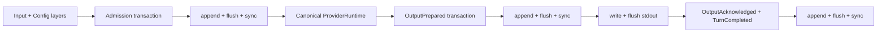

# Recoverable Single-Agent Runtime

## Decision

The first Phase 1 product slice is a synchronous, single-Agent
`RuntimeKernel` inside `greentyper-core`. It freezes configuration and provider
identity per Turn, writes canonical Runtime Events to a synchronous Event
Ledger, calls only a provider-neutral `ProviderRuntime`, and separates durable
output preparation from user-visible output acknowledgement.

This slice is deliberately smaller than the full Provider Runtime and product
Agent Team execution path. The core Kernel owns the durable Team and Tool
adapters, gates root admission, rebinds non-terminal Sessions, and reconciles
prepared Tool effects. Fixture Provider drivers can now normalize one OpenAI
Responses or Chat Completions function call, cross Tool Runtime approval and
effect durability, continue the Provider once, and prepare canonical output.
The product CLI now drives configured OpenAI/openai-compatible profiles through
an explicit frozen Responses or Chat Completions dialect and retains the
deterministic simulator for the unconfigured default. Its opt-in
`local.echo` path composes the Kernel-owned Team, Tool, Provider continuation,
explicit approval, stdout delivery, and acknowledgement seams. The
provisional checksummed file Ledger is not yet the recorded SQLite-versus-
append-log technology choice.

## Interface

```rust
let mut runtime = RuntimeKernel::open(path)?;
let prepared = runtime.execute(&layers, input, &mut provider)?;

write_and_flush(prepared.text())?;
runtime.acknowledge(prepared.delivery())?;

let (mut runtime, recovered_team) = RuntimeKernel::open_with_team(
    runtime_ledger_path,
    team_ledger_path,
    max_active_agents,
)?;
let operation = runtime.dispatch_team(TeamCommand::AdmitRoot {
    task,
    budget,
    capabilities,
})?;
runtime.acknowledge_team_operation(operation.operation)?;
for session in recovered_team.into_sessions() {
    // Kernel-derived authority; no AgentId-to-session conversion exists.
}

let (mut runtime, recovered_team) = RuntimeKernel::open_with_team_and_tools(
    runtime_ledger_path,
    team_ledger_path,
    tool_ledger_path,
    max_active_agents,
)?;
let session = recovered_team
    .into_sessions()
    .into_iter()
    .next()
    .expect("one recovered non-terminal Agent");
let request = runtime.request_tool_call(session, intent)?;
let outcome = runtime.resolve_tool_call(request, decision, &mut executor)?;
runtime.reconcile_tool_call(session, call, observed_outcome)?;

let turn = runtime.execute_provider_turn(
    session,
    &layers,
    input,
    &mut provider,
    |call| resolve_tool_resources(call),
)?;
let ProviderTurnOutcome::ApprovalRequired(approval) = turn else {
    // A text-only Provider response may already be prepared.
    todo!()
};
let prepared = runtime.resolve_provider_tool_call(
    approval,
    decision,
    &mut executor,
    &mut provider,
)?;
```

`execute` returns only after admission and the complete prepared output are
synchronously durable. `acknowledge` is a separate synchronous transaction.
The product binary owns stdout; core code never assumes that a successful
Ledger append means bytes reached the presentation sink.

## Durability Flow



Each transaction is validated against a cloned Runtime Fold before it is
written. The in-memory Fold is replaced only after the Ledger returns a
durability receipt. A write or sync error poisons that writer and is classified
as durability-ambiguous; callers must close and recover instead of retrying.

## Recovery Outcomes

| Durable state | Recovery status | Allowed action |
| --- | --- | --- |
| No pending Turn | `ready` | Admit a new Turn |
| Admission durable, Provider not completed | `resume-required` | Explicit `resume`; never automatic |
| Output prepared, acknowledgement absent | `reconciliation-required` | Explicit `reconcile`; never print or rerun automatically |
| Initial Provider request failed before its first event | `blocked`, `retryable=true` under schema 11+ | Explicit `retry --turn ID` or `cancel --turn ID`; never automatic |
| Provider failed after an event, emitted malformed events, or failed after a Tool | `blocked`, `retryable=false` | Inspect, or `cancel --turn ID` only for a typed Provider-origin block |
| Output acknowledged and Turn completed | `ready` | Duplicate acknowledgement is a no-op |

The headless CLI exposes these states through `status`. `headless` refuses every
non-ready state. `resume` and `reconcile` are explicit commands so restart
cannot silently repeat provider work or visible output.

Provider unavailability records a redacted stage before a streaming response,
before the first decoded event, or after the first event. Responses, Chat
Completions, and Messages never retry or reconnect automatically at any of
those boundaries. Because inference requests have no idempotency key, a missing
response does not establish that the remote service did no work or incurred no
usage. Schema 11+ exposes `retryable=true` only for an initial Provider request
blocked at `BeforeResponse` or `BeforeFirstEvent`. An explicit retry durably
rearms the same Turn, input, Config Epoch, and Provider Epoch before one new
Usage Attempt, and may repeat remote work or billing. Failure after the first
event, malformed output, Tool-derived state, post-Tool continuation failure, and
historical stage-untyped blocks reject retry without mutation.

Runtime Event schema 12 preserves schema 11's unavailability stage and
`TurnRetryRequested`, plus schema 10's typed `TurnBlocked` origin and
`TurnCancelled`, and permits one
`TurnRetryRequested` only for the exact retryable Provider-origin blocked Turn.
The retry transaction moves that Turn to `resume-required`; a process exit or
adapter preflight failure after the transaction is recoverable by the existing
explicit `resume`. A second early failure blocks again and requires another
explicit request. The cancellation transaction remains limited to the exact
Provider-origin blocked Turn and clears pending recovery while retaining the Turn, its completed
Usage/cost evidence, and immutable Config and Provider Epochs. A repeated exact
cancel is idempotent. Missing state is not created. Prepared output,
resume-required admission, incomplete streaming state, Tool-derived blocks,
Tool approval or reconciliation, and historical schema-9-or-earlier blocks
remain on their original fail-closed recovery path. Product retry and
cancellation require the recovered Active Agent Session that owns the Turn and
do not modify Team or Tool state. Cancellation does not call a Provider or Tool.
The local stdio App Server exposes the same exact-turn boundary through
`runtime.cancel`, `runtime.retry`, and `runtime.resume`. Cancel and retry perform
no Provider request, credential lookup, Tool execution, output delivery, or
acknowledgement. Retry only commits `TurnRetryRequested`; resume is a separate
request that reconstructs the frozen Provider Epoch and, for product state, the
single recovered Active Agent Session. Resume may repeat remote work or billing,
records ordinary Usage/cost facts, and returns prepared output or an exact Tool
approval without acknowledging it. Wrong, stale, non-retryable, non-resumable,
incomplete-tail, or missing state fails before mutation; product recovery also
leaves Team and Tool Ledgers byte-identical.

Agent Team recovery is separate from Turn output recovery. `open_with_team`
holds both dedicated writers, validates the Team replay, and returns one
`KernelTeamRecovery` containing every non-terminal process-local Session.
Terminal Agents are omitted; old Sessions remain invalid. The same typed Kernel
dispatch interface admits the single root and rejects duplicates without
mutation. Each Kernel command synchronously commits a monotonic operation
identity in the same Team transaction. A complete operation without its later
acknowledgement is exposed in `KernelTeamSnapshot.operations` and blocks new
commands until explicit acknowledgement reconciliation; operation IDs never
authorize Agent commands. This is core authority/recovery evidence, not yet a
product scheduling or output protocol. Private core tests inject errors at
eight write, flush, and sync boundaries for both command and acknowledgement
frames and kill authenticated child processes before write, inside the
frame, after flush, and after sync-before-publish. An I/O error poisons the live
writer; process termination leaves no writer to continue. Both require reopen,
which yields either a known complete prefix or a complete transaction whose
caller acknowledgement remains pending. No case automatically repeats the
command.

`open_with_team_and_tools` additionally owns a distinct Tool Ledger. A Tool
request must carry a current Active `AgentSession`; the Kernel derives the
Agent's immutable Capability Snapshot and never accepts a bare Agent ID as
authority. The Tool Runtime canonicalizes JSON arguments, persists only their
SHA-256 hash, binds the Agent, Tool name, resource axes, expiry, and hash into a
synchronous Approval Grant, and commits `EffectPrepared` in the same
transaction before invoking the executor. Raw arguments remain in the non-
clone approval request and raw output is returned ephemerally; only a result
digest enters the Ledger. A prepared effect with no terminal outcome is
reconciliation-required after restart and is never invoked automatically.
Explicit observed-success or observed-failure reconciliation is durable and
idempotent for an already-terminal call.

The explicit Provider Turn path authenticates the current Active Session
before Runtime admission. It accepts provider-neutral text, one canonical
function call, and optional Usage data; the caller resolves resource
descriptors while Tool Runtime remains the authority gate. Approval and
`EffectPrepared` are durable before the injected executor runs. A successful
UTF-8 result may then enter one Provider continuation. The final
`OutputPrepared` transaction stores the combined canonical text and one or two
bounded Usage Records. Runtime Event schema 12 preserves the schema-6 contract
that durably brackets every Provider request or continuation with Usage Attempt start/finish Events and
carries the Agent scope, Provider dialect, frozen Usage Windows, UTC times,
outcome, exact/estimated marker, optional token/cache classes, service tier, and
frozen Provider Profile snapshot, then records one frozen Price Schedule cost
evaluation plus optional selected-Preset output-token, typed reasoning-effort,
and typed service-tier policy in the Config Epoch. Requested effort/tier are
kept distinct from observed Provider metadata. Schema 9 added a bounded
`ModelSelectionStaged` Event bound to the authenticated current Agent. The next
matching `TurnAdmitted` consumes it in the same transaction as Config and
Provider freeze; pre-admission failure leaves it pending. Historical schema-1
through schema-11 Runtime transactions replay and can be followed by schema-12
transactions; schema-1 token counts become explicitly estimated legacy attempts.

This tracer bullet intentionally stores only the Tool result digest. If the
process dies after durable Tool success and before Provider continuation, the
raw result cannot be reconstructed. Recovery marks the Turn blocked rather
than repeating the Tool. Ambiguous effects similarly block continuation until
the existing explicit Tool reconciliation path resolves them.

The Team operation, Tool effect, and single-Agent Turn states have distinct
Ledgers and writer ownership. A pending Team acknowledgement blocks Team and
Tool admission. A pending Tool effect blocks new Tool calls, Team commands, and
single-Agent execute/resume until explicit reconciliation. The existing
single-Agent output acknowledgement remains independent. Product scheduling
and delivery across all three state machines remains part of the later driver.

## Ledger Adapter

The Phase 1 adapter uses:

- one process-wide exclusive standard-library file lock for writers;
- shared, read-only inspection that never truncates or repairs;
- a versioned header and bounded transaction frames;
- aggregate replay limits of one million Events and 64 MiB of Event payloads;
- explicit transaction, sequence, index, and transaction-size metadata;
- length/complement framing, CRC32C, and a final commit marker;
- synchronous file flush before a durability receipt;
- complete-prefix replay with explicit reporting and repair of one torn final
  frame only when opening a writer;
- fail-closed handling for bad magic, length check, checksum, commit marker,
  sequence, transaction metadata, UTF-8, schema, or state transition;
- expected-Head compare-and-swap inside the locked writer;
- atomic no-follow opening for the Ledger leaf file and private Unix
  permissions. Windows files inherit the parent directory DACL.

The Runtime Kernel is the sole intended owner of the writer. Raw frame types
remain provisional until the storage benchmark records the production choice
and migration policy. A caller-selected parent directory is a local trust
boundary; the adapter does not reject parent-directory links because common
platform paths may contain them.

## Frozen Snapshots

The Runtime Event projection currently freezes these Config values into each
new Turn:

- `provider.profile`;
- `provider.model`;
- `runtime.max_output_bytes`;
- resolved named Usage Windows, including concrete IANA identity and bundled
  rule-set version; and
- the resolved versioned Price Schedule book and schedule fingerprints.

The Config Runtime also owns versioned TOML and addressable Provider Profile,
Model Preset, Price Schedule, statusline, and Usage Window fields. Layers resolve in
`built-in < user < project < CLI` order. Effective values retain provenance,
reject invalid values, and the Runtime projection freezes into a read-only
`ConfigEpoch` with a deterministic fingerprint that binds schema, value, and
source. `ProviderEpoch` separately freezes the selected profile and model. For
every non-simulator Provider it also freezes a typed Provider Profile snapshot:
template identity, opaque credential reference, normalized custom origin and
routes, supported dialects, pricing source, and insecure-loopback decision.
The snapshot and Provider Epoch have deterministic fingerprints; recovery
revalidates canonical URL/route data and requires the active Provider Runtime
to present the exact frozen snapshot before any request or Tool continuation.
Schema-1 and schema-2 Provider Epochs remain readable without this newer
snapshot.
Invalid external edits retain the running process's last valid projection;
startup without one enters repair instead of silently dropping a layer.

## Current Commands

```text
greentyper headless [--ledger PATH] [--tool local.echo]
  [--preset ID | --dialect responses|chat_completions|messages] --input TEXT
greentyper resume [--ledger PATH] [--tool local.echo]
greentyper status [--ledger PATH]
greentyper stats [--ledger PATH] [--at UNIX_MS]
greentyper context status [--ledger PATH]
greentyper context reduce [--ledger PATH]
  [--max-raw-bytes N] [--max-raw-items N]
greentyper reconcile [--ledger PATH] --delivery ID
greentyper tool status [--ledger PATH]
greentyper tool reconcile [--ledger PATH] --call ID
  (--failed | --succeeded-digest SHA256)
greentyper config schema
greentyper config get PATH
greentyper config set PATH VALUE --scope user|project [--dry-run]
greentyper config reset PATH --scope user|project [--dry-run]
greentyper config repair --scope user|project
greentyper config test-provider
greentyper credential bind REFERENCE --profile PROFILE --origin URL
greentyper credential replace REFERENCE --profile PROFILE --origin URL
greentyper credential test REFERENCE --profile PROFILE --origin URL
greentyper credential forget REFERENCE --profile PROFILE --origin URL
```

Without `--ledger`, the product uses `%LOCALAPPDATA%\GreenTyper` on Windows,
`~/Library/Application Support/GreenTyper` on macOS, and the XDG state location
on other Unix systems. Without a configured Provider Profile, headless uses the
synthetic bounded simulator. Headless stdout is the raw canonical UTF-8 text
sink, not a terminal-safe or JSON framing layer. Untrusted configured Provider
output still needs an explicit framing or presentation policy before this
interface becomes a public automation protocol. In `local.echo` mode, durable
Team-operation and Tool-approval events are written as JSON to stderr and
flushed before acknowledgement; the decision is read from stdin as exactly
`approve` or `deny`.

`tool status` is a shared, read-only Tool Ledger replay. Missing product state
is reported as an empty snapshot without creating files; partial sidecars fail
closed. `tool reconcile` is an explicit mutation over the three product
Ledgers. It requires the original non-terminal Agent owner and records either
an observed failure or an observed-success SHA-256 digest. Repeating a decision
for an already-terminal call returns the durable terminal record and never
invokes the executor.

`stats` replays the Runtime Ledger into the cached Usage projection. With no
report option it preserves the original complete JSON snapshot: immutable
attempts plus Turn, Thread, Agent, Team, rolling, and versioned named-window
rollups. `--summary-only` returns aggregate total, current Thread, Team, rolling,
and named-window rollups without cloning or serializing the attempt list or the
history-sized per-Turn/per-Agent maps. `--limit N`, where `N` is 1 through 1,000,
returns one bounded attempt page and a checksummed `next_cursor`; a continuation
repeats the same limit with `--cursor`. Every report includes the Ledger
transaction/sequence revision, and its cursor is bound to both that revision and
the requested `--at` instant.
Malformed cursors fail, while a Ledger append makes an old cursor explicitly
stale instead of mixing revisions. These modes still replay the bounded Ledger;
they reduce report materialization and output, not replay I/O.
The cursor checksum detects corruption only. It carries no authority or
confidentiality; a future remote transport must bind continuation state to its
authenticated Session if it needs adversarial tamper resistance.

Context Pressure remains an immutable caller-supplied fact. The core projector
accepts immutable optional facts for context limit, used tokens, output reserve,
and exact/estimated accuracy. It uses checked integer arithmetic, preserves a
specific unknown reason, and applies the default 65% soft / 90% hard thresholds.
`execute_with_context_pressure` stops only a known hard projection, after normal
input/readiness checks but before identifier allocation, Config/Provider freeze,
Ledger append, or Provider execution. Soft pressure projects the complete
canonical Item history, keeps a default 64-KiB/32-Item recent raw tail, replaces
older text with Item-bound SHA-256 references, and publishes one checkpoint at
a Safe Barrier before admitting the next Turn. Unknown pressure continues
without inventing a checkpoint. Pressure itself is not a Runtime Event and does
not change recovery of an already admitted Turn.

Runtime Event schema 12 stores each checkpoint as a singleton transaction bound
to the exact prior Ledger head. Publication requires Ready Runtime state, no
unacknowledged Team operation, no unresolved Tool approval, and no Tool
reconciliation. A stale draft, corrupt reference, wrong source head, or unsafe
state fails before append; replay revalidates references against authoritative
canonical Items. Every publication rebuilds from full Items, so checkpoint
cycles do not recursively summarize prior checkpoints. `greentyper context
status` uses shared read-only inspection and treats a missing Ledger as empty.
`greentyper context reduce` strictly opens existing state, checks paired Product
sidecars when present, and mutates only the Runtime Ledger. It returns counts and
token/byte facts, not raw conversation text.

When a checkpoint exists, Turn admission validates it against the authoritative
canonical prefix before allocating identifiers or freezing Config/Provider
Epochs. The Provider request receives the checkpoint's bounded recent raw tail
followed by any completed canonical Items appended after its source. If the raw
tail split a prior Turn, its leading Assistant Item is omitted until the next
User Item, so every dialect receives a complete conversation boundary. Archived
artifact bodies remain omitted; no Artifact fetch or summary text is invented.
The pending user Item stays the separate current input. Recovery locates that
same user Item and rebuilds the same history projection before explicit resume,
while the frozen Config and Provider Epoch identities remain unchanged. A
missing checkpoint preserves the prior single-input request behavior.

Responses, Chat Completions, and Messages map the projected roles to ordered
native messages. Stateful Responses continuations bind the existing response;
the stateless DeepSeek Responses path, Chat Completions, and Messages retain the
same projected conversation when appending the supported Tool result. Raw
Context text is not added to Usage, checkpoint metadata, Debug output, or new
Ledger Events. Semantic handoff, provider-native compaction, external Artifact
storage, and Durable Memory remain pending.

Prompt/provider text and credential material are not part of the Usage domain.
Requested or observed metadata not supplied by the current Provider remains
unknown. Runtime Event schema 12 preserves the rule that records
`UsageAttemptFinished` before `UsageAttemptCostEvaluated` in the same transaction. The Config Epoch freezes
the resolved Price Schedule book; replay recomputes the cost claim from that
book and the normalized Usage Record, rejecting a changed schedule fingerprint,
amount, or unknown reason.

The implemented Cost Estimate is a pay-as-you-go estimate only. It freezes the
complete selected schedule, currency, version, provenance, rates, fingerprint,
token-class breakdown, and exact/estimated Usage accuracy. Missing token classes,
missing selectors, inconsistent accounting, and checked-arithmetic overflow stay
explicitly unknown. Cached rollups aggregate fixed 12-decimal pico-currency
units by currency. Provider-reported charges and subscription quota values are
not inferred or merged into that estimate. Editable Config can define only a
manual schedule. Reviewed release-bundled rate cards use frozen `template`
provenance on official origins and distinct `template_mirror` provenance on
custom origins; neither carries credential or origin authority. Provider-reported
charges still require a future dedicated authority path.

## Still Pending

- Broader multi-Tool TUI and App Server approval/result policy beyond fixed
  `local.echo`. The current product driver delivers the persisted
  operation receipt before acknowledgement and consumes only the complete
  Kernel-rebound Session bundle; it exposes no Agent-ID-to-session conversion.
  The Direct VT tracer now exposes `/blockers`. The first selection of one
  pending `local.echo` approval displays a local recovery warning; a second
  Enter confirms Provider reconstruction from the frozen Provider Epoch and
  resumes the request under the recovered Active Agent Session,
  and keeps the resulting exact arguments and resources only in memory while
  the user traverses them before Approve or Deny. Recovery may use the
  origin-bound credential, append Usage Attempt and cost records, and affect
  Provider quota or billing. Escape drops that context and
  leaves the call pending. A grant still crosses the existing bound approval and
  prepared-effect transaction before the executor; denial invokes no effect.
  Prepared Provider output remains visible until durable delivery
  acknowledgement succeeds. Failed recovery or resolution returns to blocker
  inspection; failed acknowledgement keeps the same output live for retry. The
  local stdio App Server exposes the same narrow authority through explicit
  recovery operations. `runtime.cancel` closes one exact Provider-origin block,
  `runtime.retry` only rearms an explicitly retryable Turn, and `runtime.resume`
  resumes that exact Turn under the frozen Provider Epoch and recovered Active
  Agent Session. `runtime.delivery` reads exact prepared output and
  `runtime.acknowledge` closes it durably. `tool.reconcile` records an observed
  digest or fixed failure without invoking the executor. `tool.decide` first
  reviews the exact pending `local.echo` request, returning canonical arguments,
  declared resources, and confirmation hashes. Approve or deny must echo those
  hashes on the same stream; the decision reconstructs the Provider request and
  revalidates the binding before crossing the existing Agent-session-bound
  prepared-effect boundary. Denial has zero effects and approval returns
  unacknowledged output. Review and decision may each use the origin-bound
  credential, append Usage/cost records, and affect quota or billing. Every
  mutation strictly opens existing Ledgers under exclusive locks and rejects an
  incomplete tail without repair. These operations neither admit an Agent nor
  expose Agent-ID-to-session conversion, general Runtime control beyond the
  exact recovery states, or arbitrary Tool execution. The
  Config surface gives every schema field a rendered user-scope interaction, supports all four
  Config Object creation flows, and renders typed target-layer deletion
  confirmations. Credential fields expose only an opaque reference and never
  read it back. F5 can run the existing
  bounded connection/model-list tester against that revision-bound candidate
  and render its ephemeral status. It never reads back a credential reference,
  commits through that action, or mutates a secret store. F7 separately opens
  bounded hidden bind/replace, status-only test, and confirmed forget actions
  for the exact Profile/reference/origin scope. Those actions delegate to the
  platform vault, never change Config or a Ledger, and fail closed when the
  platform backend is unavailable.
  `/config model add` can commit all required and optional Model Preset fields,
  including explicit fallback references. The separate `/model` action can
  stage one configured Preset for the existing current Agent's next Turn. It
  authenticates the rebound Session, persists only Preset identity and Config
  fingerprint facts, and grants no Provider, Tool, credential, or workspace
  authority. Release-catalog candidates remain non-runnable.
  `/config stats-window add` can commit one named Usage Window from bounded
  start, end, weekday-list, and IANA-time-zone inputs. Structured weekday text
  stays in a visible dirty buffer until it parses; preview, CAS conflict,
  explicit discard, and Config reopen use the same editor contract. The action
  does not automatically rebuild the running TUI usage projection.
  `/config pricing add` can also commit one manual Price Schedule through all 17
  schema fields. Bounded text and deferred integer input, domain validation,
  CAS conflict, explicit discard, and Config reopen use the same editor
  contract. The action does not rebuild the frozen Price Schedule book or grant
  provider-reported pricing authority.
  `/agent` can inspect the dedicated Team sidecar through a shared read-only
  lock and browse canonical Agent state plus bounded Task/budget metadata. It
  never creates or repairs Ledger state, exposes Agent Session authority,
  renders message/capsule contents, or acknowledges an operation. Incomplete
  final-frame bytes remain visible as recovery required; corruption and partial
  Product sidecars fail closed before terminal entry. Manual read-only snapshot
  refresh is available; all Agent lifecycle actions remain pending.
- Complete Config Schema default/constraint/normalization/migration metadata,
  automatic/on-open Provider discovery, and automatic Provider Profile starter
  offers and update suggestions. Release Provider Template defaults, seed
  catalog facts, explicit CLI and Direct VT discovery refresh/merge, durable
  Usage-derived Recent choices, and exact discovered-model or
  compatible-release-to-user-Preset acceptance are present. The
  terminal-neutral schema route, field view, revision-bound editor session,
  dry-run validation, atomic commit path, interaction controller, Provider
  Profile candidate/connection-test flow, and deterministic viewport-row
  projection are present. The bounded stdio App Server now exposes non-secret
  schema/get, connection-local typed Draft begin/set/reset/validate/commit,
  origin-bound credential bind/replace/test/forget, read-only `runtime.status`,
  `runtime.stats`, `agent.list`, and `tool.status` projections, plus bounded
  prepared-delivery read/acknowledgement, Tool reconciliation, and fixed
  `local.echo` approval/denial controls.
  Operational reads use fixed startup paths, never create or repair Ledger
  state, and redact Runtime item/block contents, Team text/labels/Sessions, and
  Tool arguments/resources/reasons. Credential requests return status only and
  use the platform vault. Control delegates to the Kernel/ProductDriver with a
  rebound Active Agent Session and never derives authority from numeric IDs.
  Each Ledger is inspected independently rather than under one cross-Ledger
  transaction.
- Automatic/background terminal Usage refresh, semantic/provider-native
  compaction, provider-reported charge
  and subscription-quota values, richer observed model/effort/tier
  metadata, and FMDev P6 measurements. The durable attempts, cached rollups,
  pinned Usage Windows, revision-bound summary/page `stats` projections, and
  terminal-neutral width-degradation and Context Pressure projection contracts
  are present. The Direct VT tracer now browses the latest successful rolling
  Usage summaries, durable attempt details, cached Turn aggregates, per-Turn
  Provider/Model/Dialect/Policy distributions, current Thread, Agent-usage,
  Team-usage, named-window, and rolling token/cache aggregate screens. Token &
  Cache and every scoped rollup detail include token-weighted cache-read/input
  and cache-write/input ratios, with exact, estimated, missing, internally
  inconsistent, and overflowed states kept distinct. F6 or Ctrl-R performs
  one all-or-old TUI replacement after independent local Ledger and Config
  reads; it is not a cross-Ledger transactional snapshot. No background polling
  exists.
  The separate `/agent` browser exposes read-only Team orchestration state, not a
  Usage aggregate or mutation surface. It can also
  persist every user-scope Config Schema field, can create a complete Provider
  Profile or Model Preset, a named Usage Window, and a manual Price Schedule,
  and can confirm typed
  target-layer Config Object deletion. Config commits do not automatically
  rebuild the active row projection; manual refresh is available after leaving
  the editor.
- Live inference conformance, non-Windows credential backends, configurable proxy
  policy, broader TLS platform evidence, automatic retry and partial-stream reconnect
  policy, multiple or parallel
  Tool calls, resumable result references, broader canonical Items, and the
  unimplemented Provider event kinds. The bounded SSE, OpenAI Responses and
  Chat Completions decoders, neutral normalizers, typed frozen Provider Profile
  metadata, origin-bound Windows credential lookup, configured HTTPS adapters,
  and one-Tool fixture Kernel path are present.
- Broader Tool adapters and sandboxing: the private fixed `local.echo` tracer,
  Unix process-group termination, and Windows Job wrapper are present;
  caller-selected process policy, complete Windows lifetime/resource evidence,
  filesystem/network enforcement, MCP, richer approval UX, and Tool credential
  resolution remain pending. Core call identity, Approval Grant binding,
  prepared-effect ordering, terminal digests, and reconciliation are present.
- Byte-offset process termination around every remaining Runtime, Provider,
  Tool, delivery, and product acknowledgement boundary. The prepared-effect to
  executor-entry Tool boundary has a product same-binary process-death/restart
  test. The executor-return to terminal-outcome-append Tool boundary now has an
  18-case core same-binary matrix across success, failure, ambiguous results,
  and six representative frame-write points. Remaining boundary cuts, fuzzing,
  real power-loss evidence, and Windows directory-entry durability evidence are
  still pending.
- Headless idle CPU and memory evidence on FMDev and the Target Machine.
