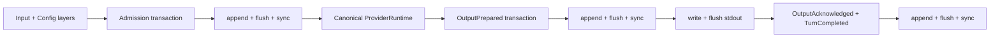

# Recoverable Single-Agent Runtime

## Decision

The first Phase 1 product slice is a synchronous, single-Agent
`RuntimeKernel` inside `greentyper-core`. It freezes configuration and provider
identity per Turn, writes canonical Runtime Events to a synchronous Event
Ledger, calls only a provider-neutral `ProviderRuntime`, and separates durable
output preparation from user-visible output acknowledgement.

This slice is deliberately smaller than the full Provider Runtime and product
Agent Team execution path. The core Kernel owns the durable Team and Tool
adapters, gates root admission, rebinds non-terminal Sessions, and reconciles
prepared Tool effects. Fixture Provider drivers can now normalize one OpenAI
Responses or Chat Completions function call, cross Tool Runtime approval and
effect durability, continue the Provider once, and prepare canonical output.
The product CLI now drives configured OpenAI/openai-compatible profiles through
an explicit frozen Responses or Chat Completions dialect and retains the
deterministic simulator for the unconfigured default. Its opt-in
`local.echo` path composes the Kernel-owned Team, Tool, Provider continuation,
explicit approval, stdout delivery, and acknowledgement seams. The
provisional checksummed file Ledger is not yet the recorded SQLite-versus-
append-log technology choice.

## Interface

```rust
let mut runtime = RuntimeKernel::open(path)?;
let prepared = runtime.execute(&layers, input, &mut provider)?;

write_and_flush(prepared.text())?;
runtime.acknowledge(prepared.delivery())?;

let (mut runtime, recovered_team) = RuntimeKernel::open_with_team(
    runtime_ledger_path,
    team_ledger_path,
    max_active_agents,
)?;
let operation = runtime.dispatch_team(TeamCommand::AdmitRoot {
    task,
    budget,
    capabilities,
})?;
runtime.acknowledge_team_operation(operation.operation)?;
for session in recovered_team.into_sessions() {
    // Kernel-derived authority; no AgentId-to-session conversion exists.
}

let (mut runtime, recovered_team) = RuntimeKernel::open_with_team_and_tools(
    runtime_ledger_path,
    team_ledger_path,
    tool_ledger_path,
    max_active_agents,
)?;
let session = recovered_team
    .into_sessions()
    .into_iter()
    .next()
    .expect("one recovered non-terminal Agent");
let request = runtime.request_tool_call(session, intent)?;
let outcome = runtime.resolve_tool_call(request, decision, &mut executor)?;
runtime.reconcile_tool_call(session, call, observed_outcome)?;

let turn = runtime.execute_provider_turn(
    session,
    &layers,
    input,
    &mut provider,
    |call| resolve_tool_resources(call),
)?;
let ProviderTurnOutcome::ApprovalRequired(approval) = turn else {
    // A text-only Provider response may already be prepared.
    todo!()
};
let prepared = runtime.resolve_provider_tool_call(
    approval,
    decision,
    &mut executor,
    &mut provider,
)?;
```

`execute` returns only after admission and the complete prepared output are
synchronously durable. `acknowledge` is a separate synchronous transaction.
The product binary owns stdout; core code never assumes that a successful
Ledger append means bytes reached the presentation sink.

## Durability Flow



Each transaction is validated against a cloned Runtime Fold before it is
written. The in-memory Fold is replaced only after the Ledger returns a
durability receipt. A write or sync error poisons that writer and is classified
as durability-ambiguous; callers must close and recover instead of retrying.

## Recovery Outcomes

| Durable state | Recovery status | Allowed action |
| --- | --- | --- |
| No pending Turn | `ready` | Admit a new Turn |
| Admission durable, Provider not completed | `resume-required` | Explicit `resume`; never automatic |
| Output prepared, acknowledgement absent | `reconciliation-required` | Explicit `reconcile`; never print or rerun automatically |
| Provider failed or emitted malformed canonical events | `blocked` | Inspect; later retry/cancel policy is a separate slice |
| Output acknowledged and Turn completed | `ready` | Duplicate acknowledgement is a no-op |

The headless CLI exposes these states through `status`. `headless` refuses every
non-ready state. `resume` and `reconcile` are explicit commands so restart
cannot silently repeat provider work or visible output.

Agent Team recovery is separate from Turn output recovery. `open_with_team`
holds both dedicated writers, validates the Team replay, and returns one
`KernelTeamRecovery` containing every non-terminal process-local Session.
Terminal Agents are omitted; old Sessions remain invalid. The same typed Kernel
dispatch interface admits the single root and rejects duplicates without
mutation. Each Kernel command synchronously commits a monotonic operation
identity in the same Team transaction. A complete operation without its later
acknowledgement is exposed in `KernelTeamSnapshot.operations` and blocks new
commands until explicit acknowledgement reconciliation; operation IDs never
authorize Agent commands. This is core authority/recovery evidence, not yet a
product scheduling or output protocol. Private core tests inject errors at
eight write, flush, and sync boundaries for both command and acknowledgement
frames and kill authenticated child processes before write, inside the
frame, after flush, and after sync-before-publish. An I/O error poisons the live
writer; process termination leaves no writer to continue. Both require reopen,
which yields either a known complete prefix or a complete transaction whose
caller acknowledgement remains pending. No case automatically repeats the
command.

`open_with_team_and_tools` additionally owns a distinct Tool Ledger. A Tool
request must carry a current Active `AgentSession`; the Kernel derives the
Agent's immutable Capability Snapshot and never accepts a bare Agent ID as
authority. The Tool Runtime canonicalizes JSON arguments, persists only their
SHA-256 hash, binds the Agent, Tool name, resource axes, expiry, and hash into a
synchronous Approval Grant, and commits `EffectPrepared` in the same
transaction before invoking the executor. Raw arguments remain in the non-
clone approval request and raw output is returned ephemerally; only a result
digest enters the Ledger. A prepared effect with no terminal outcome is
reconciliation-required after restart and is never invoked automatically.
Explicit observed-success or observed-failure reconciliation is durable and
idempotent for an already-terminal call.

The explicit Provider Turn path authenticates the current Active Session
before Runtime admission. It accepts provider-neutral text, one canonical
function call, and optional Usage data; the caller resolves resource
descriptors while Tool Runtime remains the authority gate. Approval and
`EffectPrepared` are durable before the injected executor runs. A successful
UTF-8 result may then enter one Provider continuation. The final
`OutputPrepared` transaction stores the combined canonical text and one or two
bounded Usage Records. Runtime Event schema 6 also durably brackets every
Provider request or continuation with Usage Attempt start/finish Events and
carries the Agent scope, Provider dialect, frozen Usage Windows, UTC times,
outcome, exact/estimated marker, optional token/cache classes, service tier, and
frozen Provider Profile snapshot, then records one frozen Price Schedule cost
evaluation and an optional selected-Preset output-token limit in the Config
Epoch. Historical schema-1 through schema-5 Runtime transactions replay and can
be followed by schema-6 transactions;
schema-1 token counts become explicitly estimated legacy attempts.

This tracer bullet intentionally stores only the Tool result digest. If the
process dies after durable Tool success and before Provider continuation, the
raw result cannot be reconstructed. Recovery marks the Turn blocked rather
than repeating the Tool. Ambiguous effects similarly block continuation until
the existing explicit Tool reconciliation path resolves them.

The Team operation, Tool effect, and single-Agent Turn states have distinct
Ledgers and writer ownership. A pending Team acknowledgement blocks Team and
Tool admission. A pending Tool effect blocks new Tool calls, Team commands, and
single-Agent execute/resume until explicit reconciliation. The existing
single-Agent output acknowledgement remains independent. Product scheduling
and delivery across all three state machines remains part of the later driver.

## Ledger Adapter

The Phase 1 adapter uses:

- one process-wide exclusive standard-library file lock for writers;
- shared, read-only inspection that never truncates or repairs;
- a versioned header and bounded transaction frames;
- aggregate replay limits of one million Events and 64 MiB of Event payloads;
- explicit transaction, sequence, index, and transaction-size metadata;
- length/complement framing, CRC32C, and a final commit marker;
- synchronous file flush before a durability receipt;
- complete-prefix replay with explicit reporting and repair of one torn final
  frame only when opening a writer;
- fail-closed handling for bad magic, length check, checksum, commit marker,
  sequence, transaction metadata, UTF-8, schema, or state transition;
- expected-Head compare-and-swap inside the locked writer;
- atomic no-follow opening for the Ledger leaf file and private Unix
  permissions. Windows files inherit the parent directory DACL.

The Runtime Kernel is the sole intended owner of the writer. Raw frame types
remain provisional until the storage benchmark records the production choice
and migration policy. A caller-selected parent directory is a local trust
boundary; the adapter does not reject parent-directory links because common
platform paths may contain them.

## Frozen Snapshots

The Runtime Event projection currently freezes these Config values into each
new Turn:

- `provider.profile`;
- `provider.model`;
- `runtime.max_output_bytes`;
- resolved named Usage Windows, including concrete IANA identity and bundled
  rule-set version; and
- the resolved versioned Price Schedule book and schedule fingerprints.

The Config Runtime also owns versioned TOML and addressable Provider Profile,
Model Preset, Price Schedule, statusline, and Usage Window fields. Layers resolve in
`built-in < user < project < CLI` order. Effective values retain provenance,
reject invalid values, and the Runtime projection freezes into a read-only
`ConfigEpoch` with a deterministic fingerprint that binds schema, value, and
source. `ProviderEpoch` separately freezes the selected profile and model. For
every non-simulator Provider it also freezes a typed Provider Profile snapshot:
template identity, opaque credential reference, normalized custom origin and
routes, supported dialects, pricing source, and insecure-loopback decision.
The snapshot and Provider Epoch have deterministic fingerprints; recovery
revalidates canonical URL/route data and requires the active Provider Runtime
to present the exact frozen snapshot before any request or Tool continuation.
Schema-1 and schema-2 Provider Epochs remain readable without this newer
snapshot.
Invalid external edits retain the running process's last valid projection;
startup without one enters repair instead of silently dropping a layer.

## Current Commands

```text
greentyper headless [--ledger PATH] [--tool local.echo]
  [--preset ID | --dialect responses|chat_completions|messages] --input TEXT
greentyper resume [--ledger PATH] [--tool local.echo]
greentyper status [--ledger PATH]
greentyper stats [--ledger PATH] [--at UNIX_MS]
greentyper reconcile [--ledger PATH] --delivery ID
greentyper config schema
greentyper config get PATH
greentyper config set PATH VALUE --scope user|project [--dry-run]
greentyper config reset PATH --scope user|project [--dry-run]
greentyper config repair --scope user|project
greentyper config test-provider
greentyper credential bind REFERENCE --profile PROFILE --origin URL
greentyper credential replace REFERENCE --profile PROFILE --origin URL
greentyper credential test REFERENCE --profile PROFILE --origin URL
greentyper credential forget REFERENCE --profile PROFILE --origin URL
```

Without `--ledger`, the product uses `%LOCALAPPDATA%\GreenTyper` on Windows,
`~/Library/Application Support/GreenTyper` on macOS, and the XDG state location
on other Unix systems. Without a configured Provider Profile, headless uses the
synthetic bounded simulator. Headless stdout is the raw canonical UTF-8 text
sink, not a terminal-safe or JSON framing layer. Untrusted configured Provider
output still needs an explicit framing or presentation policy before this
interface becomes a public automation protocol. In `local.echo` mode, durable
Team-operation and Tool-approval events are written as JSON to stderr and
flushed before acknowledgement; the decision is read from stdin as exactly
`approve` or `deny`.

`stats` replays the Runtime Ledger into the cached Usage projection. With no
report option it preserves the original complete JSON snapshot: immutable
attempts plus Turn, Thread, Agent, Team, rolling, and versioned named-window
rollups. `--summary-only` returns aggregate total, current Thread, Team, rolling,
and named-window rollups without cloning or serializing the attempt list or the
history-sized per-Turn/per-Agent maps. `--limit N`, where `N` is 1 through 1,000,
returns one bounded attempt page and a checksummed `next_cursor`; a continuation
repeats the same limit with `--cursor`. Every report includes the Ledger
transaction/sequence revision, and its cursor is bound to both that revision and
the requested `--at` instant.
Malformed cursors fail, while a Ledger append makes an old cursor explicitly
stale instead of mixing revisions. These modes still replay the bounded Ledger;
they reduce report materialization and output, not replay I/O.
The cursor checksum detects corruption only. It carries no authority or
confidentiality; a future remote transport must bind continuation state to its
authenticated Session if it needs adversarial tamper resistance.

Context Pressure has an initial non-durable admission seam. The core projector
accepts immutable optional facts for context limit, used tokens, output reserve,
and exact/estimated accuracy. It uses checked integer arithmetic, preserves a
specific unknown reason, and applies the default 65% soft / 90% hard thresholds.
`execute_with_context_pressure` stops only a known hard projection, after normal
input/readiness checks but before identifier allocation, Config/Provider freeze,
Ledger append, or Provider execution. Soft and unknown projections continue
through the existing admission path. Pressure is not a Runtime Event and does
not change recovery of an already admitted Turn. The Context Engine still needs
authoritative Context Views, reduction, artifact offload, Safe Barrier
checkpoints, and stale-result CAS handling.

Prompt/provider text and credential material are not part of the Usage domain.
Requested or observed metadata not supplied by the current Provider remains
unknown. Runtime Event schema 6 records `UsageAttemptFinished` before
`UsageAttemptCostEvaluated` in the same transaction. The Config Epoch freezes
the resolved Price Schedule book; replay recomputes the cost claim from that
book and the normalized Usage Record, rejecting a changed schedule fingerprint,
amount, or unknown reason.

The implemented Cost Estimate is a pay-as-you-go estimate only. It freezes the
complete selected schedule, currency, version, provenance, rates, fingerprint,
token-class breakdown, and exact/estimated Usage accuracy. Missing token classes,
missing selectors, inconsistent accounting, and checked-arithmetic overflow stay
explicitly unknown. Cached rollups aggregate fixed 12-decimal pico-currency
units by currency. Provider-reported charges and subscription quota values are
not inferred or merged into that estimate. Editable Config can define only a
manual schedule; trusted template rates and provider-reported charges require
future dedicated authority paths.

## Still Pending

- Rich TUI/App Server approval and result presentation beyond the fixed
  `local.echo` CLI. The current product driver already delivers the persisted
  operation receipt before acknowledgement and consumes only the complete
  Kernel-rebound Session bundle; it exposes no Agent-ID-to-session conversion.
- Complete Config Schema default/constraint/normalization/migration metadata,
  rendered TUI/App Server editors, live catalog discovery, and the rendered
  template-picker/starter-preset workflow. Release Provider Template defaults
  and seed catalog facts are present. The
  terminal-neutral schema route, field view, revision-bound editor session,
  dry-run validation, atomic commit path, interaction controller, Provider
  Profile candidate/connection-test flow, and deterministic viewport-row
  projection are present.
- Terminal-backed TUI/statusline Usage presentation, automatic Context View
  construction/compaction, provider-reported charge
  and subscription-quota values, richer observed model/effort/tier
  metadata, and FMDev P6 measurements. The durable attempts, cached rollups,
  pinned Usage Windows, revision-bound summary/page `stats` projections, and
  terminal-neutral width-degradation and Context Pressure projection contracts
  are present.
- Live-provider validation, non-Windows credential backends, configurable proxy
  policy, broader TLS platform evidence, reconnect policy, multiple or parallel
  Tool calls, resumable result references, broader canonical Items, and the
  unimplemented Provider event kinds. The bounded SSE, OpenAI Responses and
  Chat Completions decoders, neutral normalizers, typed frozen Provider Profile
  metadata, origin-bound Windows credential lookup, configured HTTPS adapters,
  and one-Tool fixture Kernel path are present.
- Broader Tool adapters and sandboxing: the private fixed `local.echo` tracer,
  Unix process-group termination, and Windows Job wrapper are present;
  caller-selected process policy, complete Windows lifetime/resource evidence,
  filesystem/network enforcement, MCP, richer approval UX, and Tool credential
  resolution remain pending. Core call identity, Approval Grant binding,
  prepared-effect ordering, terminal digests, and reconciliation are present.
- Byte-offset process termination around every remaining Runtime, Provider,
  Tool, delivery, and product acknowledgement boundary; fuzzing; and SQLite VFS
  fault injection.
- Headless idle CPU and memory evidence on FMDev and the Target Machine.
