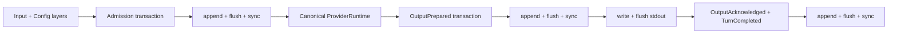

# Recoverable Single-Agent Runtime

## Decision

The first Phase 1 product slice is a synchronous, single-Agent
`RuntimeKernel` inside `greentyper-core`. It freezes configuration and provider
identity per Turn, writes canonical Runtime Events to a synchronous Event
Ledger, calls only a provider-neutral `ProviderRuntime`, and separates durable
output preparation from user-visible output acknowledgement.

This slice is deliberately smaller than the full Config Runtime, Provider
Runtime, and Agent Team integration. The deterministic simulator is not a
provider wire adapter. The provisional checksummed file Ledger is not yet the
recorded SQLite-versus-append-log technology choice.

## Interface

```rust
let mut runtime = RuntimeKernel::open(path)?;
let prepared = runtime.execute(&layers, input, &mut provider)?;

write_and_flush(prepared.text())?;
runtime.acknowledge(prepared.delivery())?;
```

`execute` returns only after admission and the complete prepared output are
synchronously durable. `acknowledge` is a separate synchronous transaction.
The product binary owns stdout; core code never assumes that a successful
Ledger append means bytes reached the presentation sink.

## Durability Flow



Each transaction is validated against a cloned Runtime Fold before it is
written. The in-memory Fold is replaced only after the Ledger returns a
durability receipt. A write or sync error poisons that writer and is classified
as durability-ambiguous; callers must close and recover instead of retrying.

## Recovery Outcomes

| Durable state | Recovery status | Allowed action |
| --- | --- | --- |
| No pending Turn | `ready` | Admit a new Turn |
| Admission durable, Provider not completed | `resume-required` | Explicit `resume`; never automatic |
| Output prepared, acknowledgement absent | `reconciliation-required` | Explicit `reconcile`; never print or rerun automatically |
| Provider failed or emitted malformed canonical events | `blocked` | Inspect; later retry/cancel policy is a separate slice |
| Output acknowledged and Turn completed | `ready` | Duplicate acknowledgement is a no-op |

The headless CLI exposes these states through `status`. `headless` refuses every
non-ready state. `resume` and `reconcile` are explicit commands so restart
cannot silently repeat provider work or visible output.

## Ledger Adapter

The Phase 1 adapter uses:

- one process-wide exclusive standard-library file lock for writers;
- shared, read-only inspection that never truncates or repairs;
- a versioned header and bounded transaction frames;
- aggregate replay limits of one million Events and 64 MiB of Event payloads;
- explicit transaction, sequence, index, and transaction-size metadata;
- length/complement framing, CRC32C, and a final commit marker;
- synchronous file flush before a durability receipt;
- complete-prefix replay with explicit reporting and repair of one torn final
  frame only when opening a writer;
- fail-closed handling for bad magic, length check, checksum, commit marker,
  sequence, transaction metadata, UTF-8, schema, or state transition;
- expected-Head compare-and-swap inside the locked writer;
- atomic no-follow opening for the Ledger leaf file and private Unix
  permissions. Windows files inherit the parent directory DACL.

The Runtime Kernel is the sole intended owner of the writer. Raw frame types
remain provisional until the storage benchmark records the production choice
and migration policy. A caller-selected parent directory is a local trust
boundary; the adapter does not reject parent-directory links because common
platform paths may contain them.

## Frozen Snapshots

The bootstrap Config schema is version 1 and contains only:

- `provider.profile`;
- `provider.model`;
- `runtime.max_output_bytes`.

Layers resolve in `built-in < user < project < CLI` order. Effective values
retain provenance, reject invalid values in every layer, and freeze into a
read-only `ConfigEpoch` with a deterministic fingerprint that binds schema,
value, and source. `ProviderEpoch` separately freezes the selected profile and
model. The full schema-driven Config Runtime in
[Configuration and Command Surface](configuration.md) remains pending.

## Current Commands

```text
greentyper headless [--ledger PATH] --input TEXT
greentyper resume [--ledger PATH]
greentyper status [--ledger PATH]
greentyper reconcile [--ledger PATH] --delivery ID
```

Without `--ledger`, the product uses `%LOCALAPPDATA%\GreenTyper` on Windows,
`~/Library/Application Support/GreenTyper` on macOS, and the XDG state location
on other Unix systems. The headless simulator output is synthetic and bounded.
Headless stdout is the raw canonical UTF-8 text sink, not a terminal-safe or
JSON framing layer. Future untrusted Provider output needs an explicit framing
or presentation policy before this interface becomes a public automation
protocol.

## Still Pending

- Persisting `Agent Team Runtime` transactions through this Ledger seam.
- Full versioned Config Schema, TOML layers, atomic edits, and repair surfaces.
- Real provider dialects, transport, reconnect policy, credentials, and usage
  normalization.
- Tool effects, Approval Grants, workspaces, checkpoints, and migrations.
- Byte-offset process termination around every Runtime durability boundary,
  fuzzing, and SQLite VFS fault injection.
- Headless idle CPU and memory evidence on FMDev and the Target Machine.
