# Tool Runtime

## Decision

Tool effect safety lives in one deep `Tool Runtime` module in
`greentyper-core`. Callers provide intent and a current `AgentSession`; they do
not choose call IDs, write approval records, order the durability boundary, or
decide whether a recovered effect may run again.

The first slice is synchronous core policy over a dedicated provisional file
Ledger. A fixture Provider Turn now reaches it through the Kernel, but execution
there still uses an injected executor. The product package now also owns a
private `local.echo` tracer over the same executor seam. It launches only a
fixed same-binary child, not a caller-selected command or shell. Unix runs in a
dedicated process group; Windows creates the child suspended, assigns a Job
Object, then resumes it. This does not claim a general filesystem/network
sandbox, network transport, MCP client, credential store, or product approval
surface.

## Interface

```rust
let (mut kernel, recovery) = RuntimeKernel::open_with_team_and_tools(
    runtime_ledger_path,
    team_ledger_path,
    tool_ledger_path,
    max_active_agents,
)?;

let request = kernel.request_tool_call(agent_session, intent)?;
let outcome = kernel.resolve_tool_call(request, approval, &mut executor)?;

// Only external evidence may resolve a prepared effect with no terminal record.
let record = kernel.reconcile_tool_call(agent_session, call, observed_outcome)?;
```

`ToolApprovalRequest` is non-clone, retains the raw canonical arguments only in
memory, and is bound to the process-local `AgentSession` that requested it.
Recovery invalidates that Session and therefore invalidates the request; a
fresh rebound Session may request the same durable identity again.

## Durable Flow

```mermaid
flowchart LR
    I["Tool intent + current AgentSession"] --> V["Canonicalize and validate"]
    V --> R["CallRequested: identity + args hash"]
    R --> RS["append + flush + sync"]
    RS --> A["ApprovalGranted + EffectPrepared"]
    A --> AS["append + flush + sync"]
    AS --> E["Invoke executor once"]
    E --> O["Succeeded, Failed, or Ambiguous"]
    O --> OS["append + flush + sync"]
```



The raw arguments, raw output, raw resource descriptors, and caller/executor
free-text reasons never enter the Tool Ledger. `CallRequested` stores a bounded
caller identity, Agent ID, Tool name, canonical argument hash, and a
domain-separated SHA-256 resource binding with per-authority-axis counts.
Success stores only a result digest. Failures persist fixed classifications
rather than external text.

## State Model

| State | Meaning | Allowed action |
| --- | --- | --- |
| `AwaitingApproval` | Identity is durable; no effect boundary crossed | Deny or grant with exact binding |
| `Denied` | Approval was durably refused | Inspect; use a new identity for changed intent |
| `ReconciliationRequired` | Grant and prepared effect are durable; terminal outcome is absent or ambiguous | Explicit observed-success/observed-failure reconciliation only |
| `Succeeded` | Result digest is durable | Duplicate identity returns the record; never invoke again |
| `Failed` | Failure or reconciled failure is durable | Duplicate identity returns the record; never invoke again |

The same identity with the same Agent, Tool, arguments hash, and resources is
idempotent across restart. Reusing it with changed meaning fails with
`IdentityConflict`.

## Authority

The Kernel authenticates the `AgentSession`, requires the Agent to be Active,
and derives its immutable Capability Snapshot. Authority axes remain
independent:

- `Tool(name)` authorizes only the named Tool;
- `WorkspaceRead` is required for filesystem reads;
- `WorkspaceWrite` is required for filesystem writes;
- `Process` is required for a process resource;
- `Network` is required for any network target.

The Approval Grant durably repeats the exact Agent, arguments hash, resource
binding, and expiry. Raw paths, process descriptors, network targets, and
credentials are not part of the persisted approval record, result, or
reconciliation record. A future concrete adapter receives an opaque credential
reference through a separate product-owned vault seam.

The product `local.echo` tracer requires the exact `Tool(local.echo)` and
`Process` authorities and rejects all filesystem and network resources even
when the Agent otherwise holds those capabilities. It clears the inherited
environment, uses a fixed working directory and child argv, pipes stdin/stdout/
stderr, applies a five-second deadline and a combined 256 KiB output limit,
and never invokes a shell. Timeout, output overflow, or post-launch I/O
uncertainty returns `ReconciliationRequired`; a proven pre-spawn failure is a
normal durable failure.

## Failure Rules

- Failure to persist `CallRequested` or `EffectPrepared` invokes no executor.
- Any Ledger write/flush/sync error poisons that writer; callers close and
  reopen instead of retrying.
- Once `EffectPrepared` is durable, absence of a terminal record is ambiguous
  even when the local process believes it did not finish.
- A terminal append failure after executor invocation reopens as
  `ReconciliationRequired`; it never invokes the executor automatically.
- Explicit reconciliation requires a current Active `AgentSession` for the
  original call owner and records observed success or failure durably. It does
  not rerun the effect.

## Current Evidence And Pending Work

Core tests cover canonical argument hashing, strict schema/kind decoding,
identity deduplication and changed-meaning rejection, restart replay, stale
Session rejection, independent authority denial, approval expiry, raw-argument
and raw-resource exclusion, ambiguous blocking, explicit reconciliation,
pre-effect durability failure with zero executor calls, and post-effect outcome
failure with exactly one executor call.

The Provider tracer bullet additionally proves one normalized Responses
function call enters this exact approval/effect state machine, continuation is
blocked for ambiguous or invalid results, and a successful effect whose raw
result is lost at process death is not repeated. The Runtime Turn becomes
blocked because only the digest is durable; storing a resumable redacted result
reference remains a later contract.

Product integration tests additionally execute `local.echo` in a real child,
reopen its digest, reject unsupported authority and argument shapes, prove
environment and working-directory isolation, stop blocked stdin and output
floods at the deadline, kill Unix descendants as a process group, and preserve
failed or ambiguous no-repeat state. A Windows-only test verifies that the Job
Object's active-process limit denies a descendant; cross-target checks compile
the audited handle wrapper.

Still pending: a public Product Tool driver and approval/result delivery,
caller-selected process policy, complete Windows Job kill-on-close and memory-
limit evidence on the Target Machine, filesystem/network/MCP adapters,
credential-vault integration, multiple Provider Tool calls, cross-process
byte-offset termination around every effect boundary, fuzzing, and production
storage migration.
